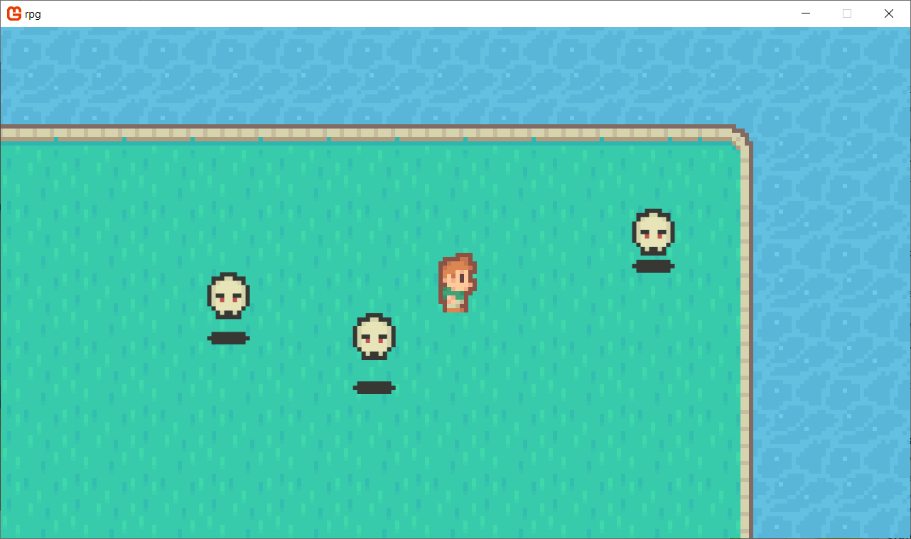

# RPG_MonoGame
 My third game for MonoGame framework. This project is implementation of basic character movement and following with camera. Player must avoid other enemies and stay as long as possible. This project based on Udemy course: https://www.udemy.com/course/monogame/, section: "Game #3: RPG".

## Screenshots

### Game beginning

### Avoid enemys

### Shooting
